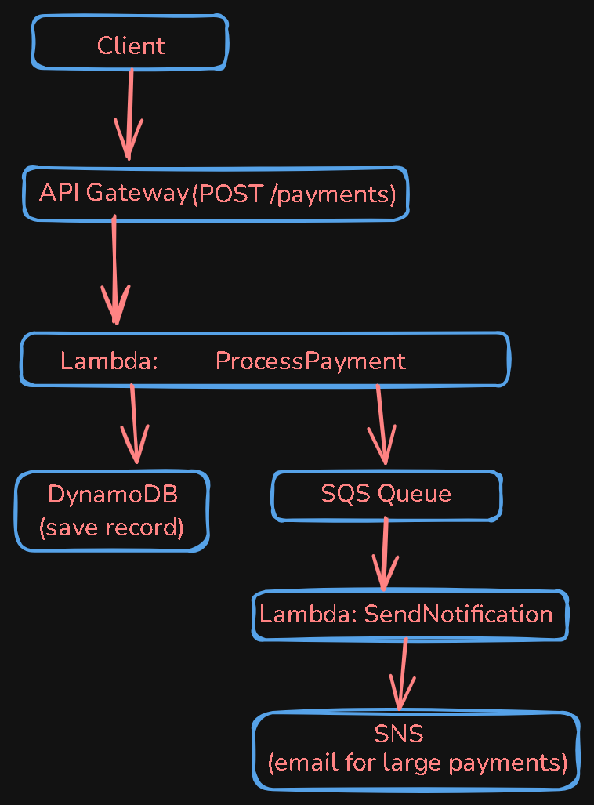

# Serverless Payment API


A production-ready serverless payment API built on AWS. Processes payments, persists transactions to DynamoDB, queues async jobs via SQS, and sends real-time email alerts for large payments via SNS — zero servers, fully managed.

---

## Architecture

```
Client
  │
  │  POST /payments
  ▼
API Gateway
  │
  ▼
Lambda: ProcessPaymentNotification (Python 3.12)
  │                        │
  ▼                        ▼
DynamoDB              SQS Queue
Payment-Transactions  PaymentProcessingQueue
(persist record)      (async processing)
                           │
                           ▼
                      Lambda: SendNotification
                           │
                           ▼
                          SNS
                    OluTech-Alerts
                 (email for payments > 100,000)
```



---

## Services Used

| Service | Role |
|---|---|
| **API Gateway** | HTTP entry point, routes POST /payments |
| **Lambda (Python 3.12)** | Business logic — validates, stores, queues |
| **DynamoDB** | Persists all transaction records |
| **SQS** | Decouples async payment processing |
| **SNS** | Sends email alerts for large payments |
| **CloudWatch** | Logs and monitors all Lambda executions |
| **IAM** | Least-privilege roles for Lambda |

---

## How to Deploy

### Prerequisites
- AWS account with admin access
- AWS CLI configured (`aws configure`)
- Python 3.12

### Step 1 — Create DynamoDB Table
```
Table name:     Payment-Transactions
Partition key:  TransactionID (String)
Sort key:       Timestamp (String)
Capacity mode:  On-Demand
```

### Step 2 — Create SQS Queue
```
Queue name:  PaymentProcessingQueue
Type:        Standard
```

### Step 3 — Create SNS Topic
```
Topic name:  OluTech-Alerts
Type:        Standard
Subscription: Email → your@email.com
```

### Step 4 — Create Lambda Function
```
Function name:  ProcessPaymentNotification
Runtime:        Python 3.12
```

Attach these IAM policies to the Lambda role:
- `AmazonDynamoDBFullAccess`
- `AmazonSQSFullAccess`
- `AmazonSNSFullAccess`

### Step 5 — Deploy Lambda Code
Copy `lambda_function.py` into the Lambda editor.
Update these two values with your own:
```python
QueueUrl='https://sqs.us-east-1.amazonaws.com/YOUR_ACCOUNT_ID/PaymentProcessingQueue'
TopicArn='arn:aws:sns:us-east-1:YOUR_ACCOUNT_ID:OluTech-Alerts'
```
Click **Deploy**.

### Step 6 — Create API Gateway
```
API type:    REST API
Name:        PaymentAPI
Resource:    /payment
Method:      POST → Lambda integration
Stage:       prod
```

---

## API Usage

### POST /payments

Processes a payment transaction.

**Endpoint:**
```
POST https://{api-id}.execute-api.us-east-1.amazonaws.com/prod/payment
```

**Request Body:**
```json
{
  "sender": "Alice",
  "recipient": "Bob",
  "amount": 5000,
  "reference": "TXN-001"
}
```

**Success Response (200):**
```json
{
  "message": "Payment processed successfully",
  "reference": "TXN-001",
  "timestamp": "2026-06-23T01:11:22.102005",
  "status": "Completed"
}
```

---

## Example Requests

### Normal Payment
```bash
curl -X POST https://{api-id}.execute-api.us-east-1.amazonaws.com/prod/payment \
  -H "Content-Type: application/json" \
  -d '{
    "sender": "Alice",
    "recipient": "Bob",
    "amount": 5000,
    "reference": "TXN-001"
  }'
```

### Large Payment (triggers SNS email alert)
```bash
curl -X POST https://{api-id}.execute-api.us-east-1.amazonaws.com/prod/payment \
  -H "Content-Type: application/json" \
  -d '{
    "sender": "Alice",
    "recipient": "Bob",
    "amount": 500000,
    "reference": "TXN-002"
  }'
```

---

## Technologies Used

- **AWS Lambda** — Serverless compute (Python 3.12)
- **Amazon API Gateway** — REST API management
- **Amazon DynamoDB** — NoSQL transaction storage
- **Amazon SQS** — Async message queuing
- **Amazon SNS** — Push notification / email alerting
- **Amazon CloudWatch** — Logging and observability
- **AWS IAM** — Identity and access management

---

## Portfolio

Built as part of the **AWS Cloud Accelerator** program — Week 7 Capstone.

Live API: `https://{api-id}.execute-api.us-east-1.amazonaws.com/prod/payment`

> Built by Oluwatoba | [LinkedIn](#) | [Portfolio](#)
